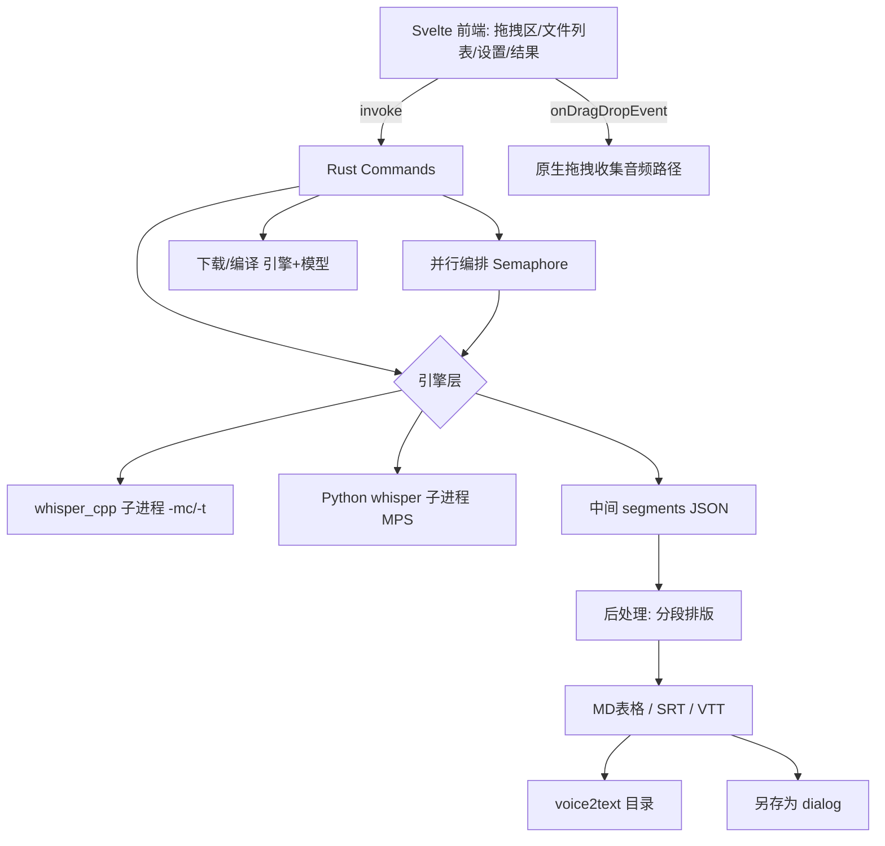

## 用户需求

将本机语音转写能力打包成一个完全离线运行的 macOS 桌面应用「小柳语音转写」，采用 Tauri + Rust + 纯 Svelte（尽量轻量化，不引入多余语言/库），界面全程不出现 "whisper" 字样，但软件内深度集成引擎的一键下载与部署。

## 产品概述

基于 Tauri v2 的本地桌面工具：拖入音频文件或文件夹即可批量转写，自动利用 Apple 芯片的 CoreML/Metal 加速并按配置并行处理；转写结果自动分段排版，导出为 MD 表格与字幕文件（SRT/VTT），自动写入输入目录下的 voice2text 文件夹，也支持另存到任意目录。

## 核心功能

- 批量转写：拖拽文件或文件夹，递归收集音频，多文件并行转写
- 双引擎可切换：标准引擎（whisper.cpp，CoreML/Metal 自动选择）+ 兼容引擎（本机 Python openai-whisper）
- 一键部署：首次运行自动下载/编译标准引擎与模型，下载/编译进度实时可见
- 加速自适应：检测 Apple 芯片与内存，自动推荐模型大小与加速方式，并行 worker 数可配置
- 自动排版分段：按句末标点和静音间隔合并/断段，生成自然段落
- 多格式导出：MD 表格（时间区间｜文本）+ 字幕 SRT/VTT，自动写入 voice2text 目录
- 另存为：通过原生保存对话框导出到任意目录
- 极简界面：纯 Svelte + 极简 CSS，文案与命名不出现 whisper

## 技术栈

- 桌面框架：Tauri v2（tauri-cli 2.11.4，已就绪）
- 后端语言：Rust 1.97；异步 tokio（Semaphore 并发）、reqwest（流式下载）、serde/serde_json、chrono、anyhow
- 前端：Svelte 5 + Vite（纯 JS，零额外 UI 库），极简 CSS
- 插件：tauri-plugin-dialog（原生保存/选择对话框）
- 引擎：whisper.cpp（C++，源码 cmake 编译启用 CoreML/Metal）；Python openai-whisper 20250625（本机已装 /Library/Frameworks/Python.framework/Versions/3.12/bin/whisper）

## 实现方案

### 总体策略

Rust 后端以 `std::process` 直接调用两个引擎的 CLI 子进程（不引入 shell 插件，更轻），用 tokio 异步 + 信号量做批量并行；每个文件产出 segments JSON，再由 Rust 后处理为 MD/SRT/VTT。前端 Svelte 通过 `invoke` 发命令、监听 Tauri 事件获取进度。

### 关键决策

1. 双引擎统一接口：`engine::whisper_cpp` 与 `engine::python_whisper` 都实现 `transcribe(input, opts) -> Vec<Segment>`。主力走 whisper.cpp（原生 CoreML/Metal + 易并行）；兼容引擎直接调用本机 `whisper` CLI（`--output_format srt,txt,json --output_dir <tmp>`），设置 `PYTORCH_ENABLE_MPS_FALLBACK=1` 利用 MPS。
2. 加速自动选择：`platform` 模块读 `sysctl machdep.cpu.brand_string`（含 "Apple" → Apple Silicon）与 `hw.memsize`（RAM）。whisper.cpp 编译带 `WHISPER_COREML=1`，运行时传 `-mc` 启用 Core ML（Metal 为默认后端），非 Apple 芯片自动回退 Metal；据此推荐模型（RAM≥16G 推荐 small/medium 量化，否则 base 量化）。
3. 并行：tokio::sync::Semaphore 控制 worker 数（默认 = 性能核数，M2 Pro≈6~8，设置可改），每音频独立子进程互不阻塞。
4. 部署：`ensure_standard_engine` 下载 whisper.cpp 源码 tarball（GitHub release）→ cmake 编译（`WHISPER_COREML=1 WHISPER_METAL=1`）→ 下载 ggml 模型（HuggingFace，base/small 量化）→ 进度经事件回传；编译失败给出明确提示（缺失 cmake/Xcode）。
5. 输出目录规则：拖入文件夹→`<folder>/voice2text/`；拖入多文件→公共父目录 `/voice2text/`（无公共父目录取首个文件父目录）；不存在则新建。另存走 dialog `save` + Rust 写文件（规避 WKWebView 不支持 blob 下载）。
6. 拖拽陷阱：`tauri.conf.json` 设 `window.dragDropEnabled:false`；前端 `onDragDropEvent` 拿 paths，递归收集音频（mp3/wav/m4a/flac/ogg/aac/opus）。

### 性能与可靠性

- 子进程 I/O：逐个文件转写，内存峰值 ≈ 单模型占用 × 并发数，Semaphore 限制避免 OOM。
- 进度：每文件完成发事件，避免前端轮询；下载用 reqwest 流式 + content-length 算百分比。
- 错误隔离：单文件失败标记状态并继续，不影响整批。
- 调试 harness：index.html 注入 `window.addEventListener("error")` → `invoke("debug_log")` 写 `/tmp/tauri-debug.log`；Rust `debug_log` command（chrono 时间戳）。注意避免定义 `isTauri()` 全局名；打包后 `xattr -d com.apple.quarantine` 去隔离。

## 架构设计



## 目录结构

```
/Users/kimliu/CodeBuddy/20260715162738/
├── package.json              # [NEW] Svelte+Vite 依赖与脚本
├── vite.config.js            # [NEW] Vite 配置
├── svelte.config.js          # [NEW] Svelte 配置
├── index.html                # [NEW] 入口 + 注入 window error 监听(debug_log)
├── src/
│   ├── main.js               # [NEW] Svelte 应用入口
│   ├── App.svelte            # [NEW] 根布局，组合各区块
│   ├── app.css               # [NEW] 极简全局样式
│   ├── lib/
│   │   ├── api.js            # [NEW] Tauri invoke 封装 + 事件监听
│   │   ├── dragdrop.js       # [NEW] onDragDropEvent + 递归收集音频
│   │   └── components/
│   │       ├── DropZone.svelte       # [NEW] 拖拽区
│   │       ├── FileList.svelte       # [NEW] 文件列表+进度状态
│   │       ├── SettingsPanel.svelte  # [NEW] 引擎/模型/语言/格式/并行设置
│   │       ├── ResultView.svelte     # [NEW] 分段正文预览+导出/另存
│   │       └── EngineSetup.svelte    # [NEW] 一键部署进度条
└── src-tauri/
    ├── Cargo.toml            # [NEW] tauri + tokio + reqwest + serde + chrono + dialog
    ├── tauri.conf.json       # [NEW] dragDropEnabled:false, dialog 插件, bundle 图标
    ├── build.rs              # [NEW] 标准 Tauri build
    ├── icons/                # [NEW] cargo tauri icon 生成
    └── src/
        ├── main.rs           # [NEW] builder 注册命令 + debug_log
        ├── commands.rs       # [NEW] ensure_standard_engine/transcribe_batch/save_as/get_engine_status/debug_log
        ├── engine/
        │   ├── mod.rs            # [NEW] 引擎 trait/统一接口
        │   ├── whisper_cpp.rs    # [NEW] 构建子进程 + CoreML/Metal 参数 + 模型管理
        │   ├── python_whisper.rs # [NEW] 构建本机 Python whisper 子进程
        │   └── download.rs       # [NEW] reqwest 流式下载 + 进度回调
        ├── transcribe.rs     # [NEW] 并行批量编排(Semaphore) + 进度事件
        ├── postprocess.rs    # [NEW] 分段排版 + MD/SRT/VTT 生成 + 写入 voice2text
        └── platform.rs       # [NEW] Apple 芯片/RAM/性能核数检测
```

## 关键代码结构

```rust
#[derive(Serialize, Deserialize, Clone)]
pub struct Segment { pub start: f64, pub end: f64, pub text: String }

#[derive(Serialize, Deserialize, Clone)]
pub struct TranscribeOptions {
  pub engine: String,         // "standard" | "compat"
  pub model: String,          // "base" | "small" | 模型路径
  pub language: String,       // "auto" | "zh" | "en"
  pub output_formats: Vec<String>, // ["md","srt","vtt"]
  pub parallel: u32,
  pub output_base: String,    // voice2text 所在父目录
}

#[tauri::command] async fn ensure_standard_engine(app: tauri::AppHandle) -> Result<EngineStatus, String>
#[tauri::command] async fn transcribe_batch(paths: Vec<String>, opts: TranscribeOptions) -> Result<BatchResult, String>
#[tauri::command] async fn save_as(path: String, content: String) -> Result<(), String>
#[tauri::command] fn get_engine_status() -> EngineStatus
```

## 设计风格

采用 Apple HIG 风格的极简 macOS 原生观感：明亮干净、圆角卡片、柔和阴影、轻微毛玻璃与微渐变，配合 hover/进度过渡微动画，营造专业且轻盈的工具质感。纯 Svelte 组件 + 手写极简 CSS，不引入第三方 UI 库，全程文案不出现 whisper。

## 页面区块规划（单窗口）

- 顶部栏：左侧应用名「小柳语音转写」+ 引擎状态指示灯；右侧「安装本地引擎/准备环境」按钮（未就绪时高亮）。
- 拖拽区：居中的大号虚线落区，支持文件与文件夹拖入，显示「拖入音频或文件夹」。
- 文件列表：卡片列表，每行显示文件名、状态（等待/转写中/完成/失败）、单文件进度条。
- 设置面板（可折叠）：引擎切换（标准/兼容）、模型选择、语言（自动/中文/英文）、导出格式多选（MD/SRT/VTT）、并行数滑块。
- 结果区：分段正文预览（可滚动），底部「导出到 voice2text」「另存为」按钮。
- 部署进度：顶部栏下方细进度条 + 百分比，安装完成后自动隐藏。

各区块自上而下排布，设置面板与结果区通过状态联动；整体响应式适配窗口缩放。